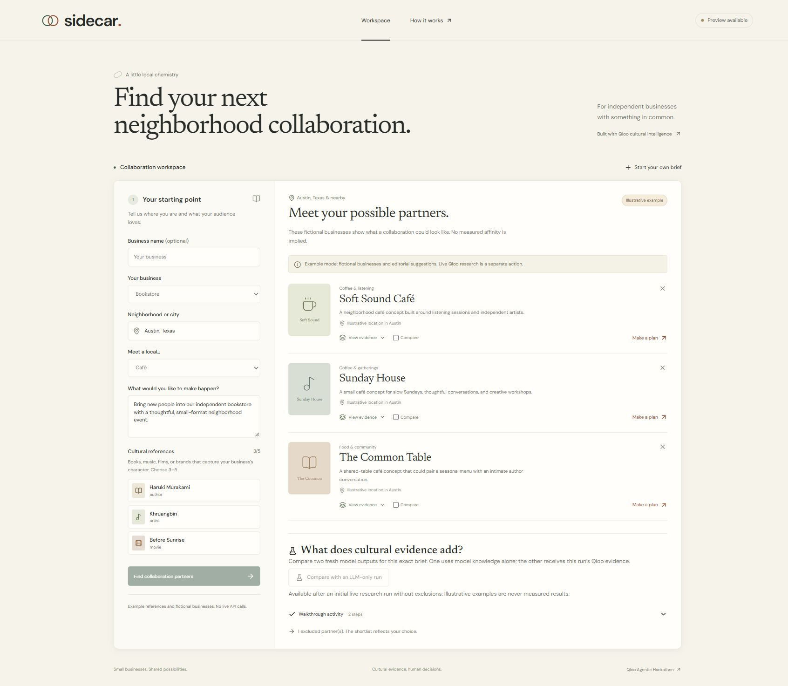

# Sidecar

[](https://github.com/popcorntoocold/sidecar/actions/workflows/verify.yml)

Find your next neighborhood collaboration using cultural evidence. Sidecar is a Qloo Agentic Hackathon project for independent bookstores and cultural businesses researching local partners.

**Try the [public walkthrough](https://sidecar-qloo.onrender.com/)** and choose **Or explore a complete example**. It uses fictional businesses and never substitutes for live provider results. Free hosting may take about a minute to wake after inactivity.

**Current state (October 6, 2026):** local live Qloo discovery verified on three fixed briefs, with paired model comparisons and proposal generation. Exclusions reuse evidence, and a changed cultural reference refreshes discovery. Live tests exposed category and geographic limitations, so no recommendation-quality advantage is claimed. The public host still serves the illustrative walkthrough; live public deployment, owner feedback, demo video and final submission remain pending. See [live findings](docs/live-results-2026-10-06.md).



*Illustrative example with fictional businesses. Local live results are documented separately.*

## Try it locally

Use Node >=22.19.0 and pnpm 12.9.1. Install pnpm with `npm install --global pnpm@12.9.1`, then run:

```sh
pnpm install --frozen-lockfile --ignore-scripts
pnpm run dev
```

Open http://127.0.0.1:4310 and choose **Explore a complete example**. Inspect evidence, compare partners, exclude one, create a proposal, edit the proposal, and export the brief. Starting your own brief invokes the live flow and requires credentials.

On Windows, confirm `node --version` meets the requirement. You can start the server directly with `node --env-file-if-exists=.env --import tsx server/index.ts` when package-manager shell wrappers are unavailable.

## Configure live research

Request your own event-issued key from the [official Qloo resources](https://qloo.devpost.com/resources). Configure it privately. Never paste keys into Devpost, chat, source code, screenshots or browser fields.

Copy `.env.example` to `.env`, then set `QLOO_API_KEY`, `OPENAI_API_KEY`, and `OPENAI_MODEL`. Set `OPENAI_MODEL=gpt-5.4-mini-2026-03-17` and an explicitly approved `OPENAI_TEST_BUDGET_USD`. This snapshot has a verified rate for the spend guard; other models are refused. No billable model or budget is selected by default in the template. Restart the server after setting credentials. The server fixes both Qloo endpoint settings to https://hackathon.api.qloo.com, as required for event-issued keys. Qloo calls use the pinned official `@qloo/qloo-harness` package, server-side.

```sh
pnpm run check:live
```

The check makes minimal entity/tag requests, and fails explicitly if credentials are missing. It does not certify the complete integration. In the browser, resolve and confirm three cultural references, confirm a returned Qloo partner category, and run research. Verify the city, results, evidence and revisions before considering the entry live.

`QLOO_HOURLY_WORKFLOW_LIMIT` caps reserved workflow calls per server process per hour. A workflow can make several API requests; configure this conservatively from the actual event quota. Public operation currently requires a single server process. Multiple replicas would need a shared limiter and store. The app reserves eight calls for each research run, limits concurrent requests, and keeps research records and identical provider requests in bounded memory for 30 minutes. Exclusions reuse discovery and refresh analysis only when its inputs change. Cached evidence preserves its original retrieval time. No customer records are collected.

## How the agent works

1. Resolve cultural references and category tags using Qloo; let the owner confirm matches.
2. Discover geographically filtered places using the confirmed references and category.
3. Ask a constrained planner whether shortlist ranking or audience comparison would add useful evidence.
4. Retain provider evidence and the original discovery order. Optional analysis is visible separately.
5. Show changed inputs, partners, and reused evidence when the owner revises a brief.
6. Draft an editable collaboration proposal linked to known evidence records.
7. Optionally generate separate LLM-only and Qloo-grounded shortlists for the same initial brief. Export both outputs, provenance, model version, timestamps and measured latency.

The server owns entity IDs and constraints. Model responses cannot issue arbitrary commands, change cities, or invent accepted citations. Provider content is treated as untrusted data. Credentials stay out of the browser bundle and logs.

Qloo metrics describe aggregate affinities. They do not establish actual customer overlap, sales, availability, or a business's willingness to partner. The supported harness can include nearby areas; the UI states this. No strict city-boundary guarantee is made.

## Verification

```sh
pnpm test
pnpm run build
pnpm run evaluate path/to/redacted-live-runs.json
```

Tests cover validation, process isolation, provider parsing, cancellations, budgets, unsupported actions/citations, preview separation, stale UI requests and HTTP behavior. External providers are isolated with explicit fixtures. An offline green suite does not prove live Qloo compatibility.

The evaluation summary accepts live Qloo research records only. It reports observable evidence coverage and duration, not recommendation accuracy or business impact. See [evaluation status](docs/evaluation.md).

The pinned pnpm setup applies patched transitive versions of undici and brace-expansion. npm installations do not reproduce this fix because an upstream dependency ships its own shrinkwrap. Use the committed pnpm lockfile; install scripts are disabled because platform binaries are supplied by registry packages.

## Deployment

The Dockerfile builds a single-process Node service. The selected free deployment uses Render Free and a dedicated Upstash Free database for the model spending record. See the [free deployment procedure](docs/deployment.md) and [preview blueprint](deploy/render-free.yaml). A custom domain is optional. Free Render instances sleep after inactivity, so opening the demo can take about a minute.

Paid model usage needs either the complete remote ledger configuration or an absolute `OPENAI_BUDGET_FILE` path on persistent storage writable by the container user (UID 1000). Never delete or reset the ledger during the same authorized allowance. Each request reserves a conservative upper bound before sending; failures retain reservations. Missing or unverifiable remote records block requests, and never fall back to ephemeral local files. This guard is not a billing reconciliation report.

Configure secrets at the host, set a deliberate `QLOO_HOURLY_WORKFLOW_LIMIT`, expose port 4310 behind HTTPS, and keep the instance online through judging. Do not expose `.env` or development tooling publicly.

```sh
docker build -t sidecar-local .
docker run --rm -p 127.0.0.1:4311:4310 -e QLOO_HOURLY_WORKFLOW_LIMIT=30 sidecar-local
```

That command starts only a local preview without keys. A public URL and verified live-provider behavior are still required for the competition.

The GitHub verification workflow builds the container, runs its tests and compiler, checks concurrent budget reservations against real Redis, then checks the production preview with no provider keys. It never uses paid API credentials.

## Project documents

- [Approved specification](docs/superpowers/specs/2026-10-04-sidecar-design.md)
- [Approved implementation plan](docs/superpowers/plans/2026-10-04-sidecar.md)
- [Submission working draft](docs/submission.md)
- [Evaluation status and owner feedback guide](docs/evaluation.md)
- [Live validation protocol](docs/live-validation.md)
- [Deployment configuration and cost review](docs/deployment.md)

MIT-licensed original application code. Qloo, fonts, libraries and other dependencies retain their own licenses and service terms.


